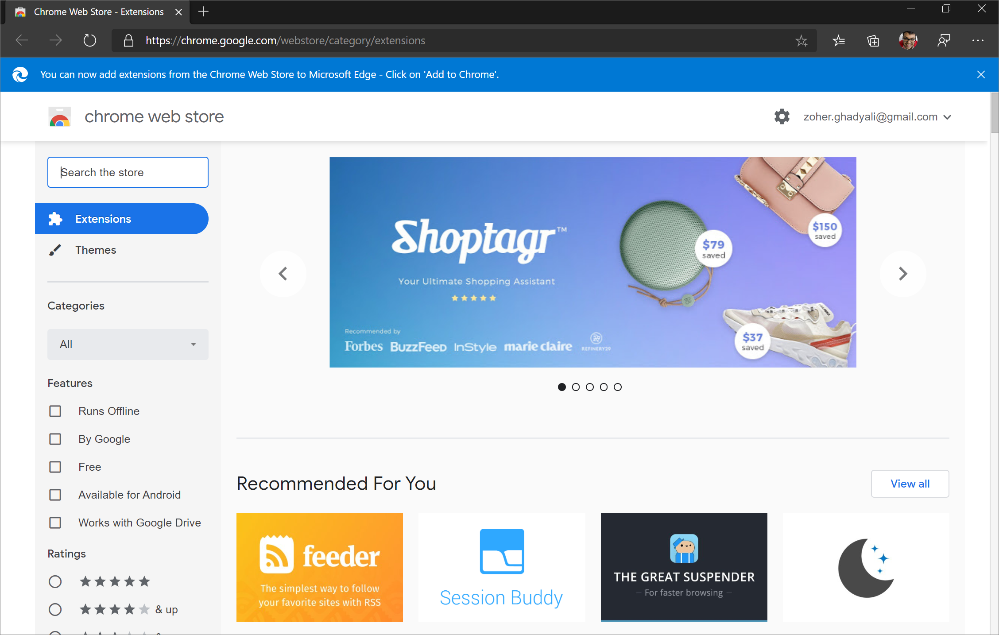
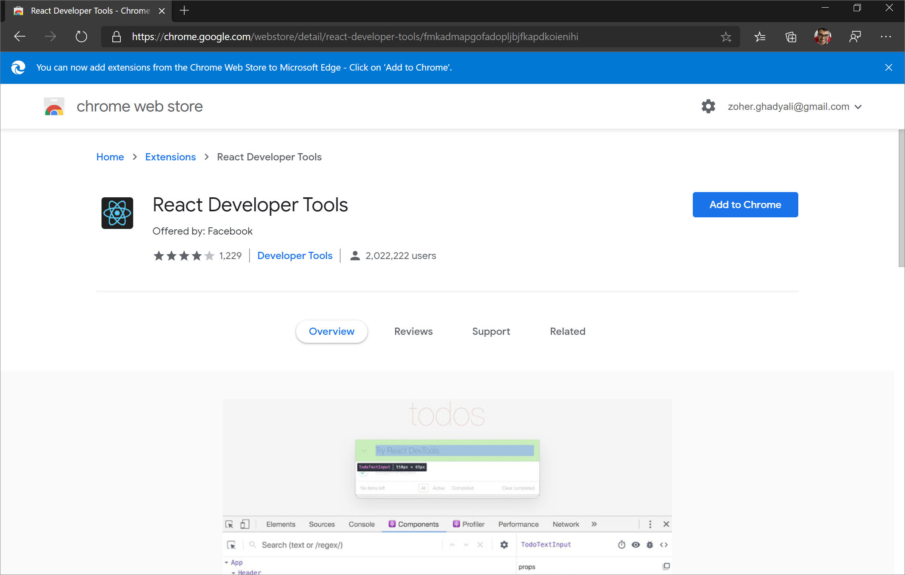

# Microsoft Edge (Chromium) Developer Tools  

Microsoft Edge has adopted the Chromium open source project to create better web compatibility and less fragmentation of different underlying web platforms.  This change should make it easier for you to build and test your websites in Microsoft Edge and ensure that each works as expected even while your users are browsing in a different Chromium-based browser \(such as Google Chrome, Vivaldi, Opera, or Brave\).  

As the web has grown in usage across an ever-widening array of device types, the complexity and overhead involved in testing websites has exploded. Since web developers \(particularly those at small companies\) must test against so many different systems, you may find it nearly impossible to ensure that sites work well on all device types and all browsers.  Now that Microsoft Edge is based on Chromium, the Microsoft Edge team has simplified the matrix by aligning the Microsoft Edge web platform with other Chromium-based browsers and provided a best-in-class developer tooling experience, both inside the browser and with the other developer tools you use every day \(such as Visual Studio Code\).  

If you are checking out Microsoft Edge and you mainly develop in a Chromium-based browser, you should feel right at home.  The Microsoft Edge \(Chromium\) Developer Tools function in the same way as the developer tools you already know and use.  For more info, see [What's new in the Microsoft Edge (Chromium) DevTools][DevtoolsChromiumWhatsNew].  

:::image type="complex" source="./devtools-guide-chromium/media/devtools.png" alt-text="Microsoft Edge (Chromium) DevTools":::
   Microsoft Edge (Chromium) DevTools
:::image-end:::

<!--  -->  

If you are checking out Microsoft Edge \(Chromium\) and you previously developed in Microsoft Edge \(EdgeHTML\), you now have some great new tools that should make it easier and faster to build and test your websites in Microsoft Edge!  

## Open the DevTools  

If you have never used the DevTools before, the Microsoft Edge Developer Tools are a set of tools built directly into the Microsoft Edge browser.  With these DevTools, you are able to do the following.  
*   Inspect and make changes to your HTML website  
*   Edit CSS and instantly see preview how your website renders  
*   See all the `console.log()` statements from your front-end JavaScript code  
*   Debug your script by setting breakpoints and stepping through it line by line  

all directly within the browser.  These are just examples of some of the features the DevTools provide to make it easier and faster for you to build and test your websites in Microsoft Edge.  

To open the DevTools  
*   press `F12` 
*   press `Ctrl`+`Shift`+`I` on Windows \(`Command`+`Option`+`I` on macOS\)  

If you want to see the HTML or CSS for an element on your site, right-click the element and select **Inspect** to jump into the Elements panel.  You may also press `Ctrl`+`Shift`+`C` on Windows \(`Command`+`Option`+`C` on macOS\) to open the DevTools in **Inspect Element Mode** which lets you select an element on the site and see the HTML and CSS in the **Elements** panel.  

If you want to see logs from your front-end JavaScript code or quickly run some script, press `Ctrl`+`Shift`+`J` on Windows \(`Command`+`Option`+`J` on macOS\) to launch the Console panel in the DevTools.  

## Core tools  

:::image type="complex" source="./devtools-guide-chromium/media/devtools-core-tools.png" alt-text="Microsoft Edge (Chromium) DevTools core tools":::
   Microsoft Edge (Chromium) DevTools core tools
:::image-end:::

<!--  -->  

The Microsoft Edge \(Chromium\) DevTools include the following panels.  
*   An **Elements** panel to edit HTML and CSS, inspect accessibility properties, view event listeners, and set DOM mutation breakpoints  
*   A **Console** to view and filter log messages, inspect JavaScript objects and DOM nodes, and run JavaScript in the context of the selected window or frame  
*   A **Sources** panel to open and live edit your code, set breakpoints, step through code, and see the state of your website one line of JavaScript at a time  
*   A **Network** panel to monitor and inspect requests and responses from the network and browser cache   
*   A **Performance** panel to profile the time and system resources required by your site  
*   A **Memory** panel to measure your use of memory resources and compare heap snapshots at different states of code runtime  
*   An **Application** panel to inspect, modify, and debug web app manifests, service workers, and service worker caches.  You may also inspect and manage storage, databases, and caches from this panel.  
*   A **Security** panel to debug security issues and ensure that you have properly implemented HTTPS on your website.  HTTPS provides critical security and data integrity for both your site and your users that provide personal information on your site.  
*   An **Audits** panel \(now renamed **Lighthouse**\) to run an audit of your website.  The results of the audit help you improve the quality of your site in the following ways.  
    *   Catch common errors related to making your website accessible, secure, performant, and so on.  
    *   Fix each error.  
    *   Build a PWA.  

[!INCLUDE [audits-panel-note](./devtools-guide-chromium/includes/audits-panel-note.md)]  

Please send your [feedback and feature requests](#feedback)!  

## Extensions  

You may have used extensions to the DevTools to help you diagnose and debug issues when building your websites or apps.  You may acquire extensions for Microsoft Edge from [the Microsoft Edge Addons][MicrosoftEdgeAddonsExtensions] page.  From this page, you may browse DevTools extensions from the **Developer tools** category or search for a specific extension.  

You may also add extensions from the [Chrome Web Store][GoogleChromeWebstoreExtensions].  

:::image type="complex" source="./devtools-guide-chromium/media/allow-extensions-from-stores.png" alt-text="Chrome Web Store in Microsoft Edge":::
   Chrome Web Store in Microsoft Edge
:::image-end:::

<!--  -->

At the top, select **Allow extensions from other stores** and then select **Allow** in the dialog that appears.  

> [!NOTE]
> Extensions installed from sources other than the Microsoft Store are unverified, and may affect browser performance.  

Select **Add to Chrome** to add your DevTools extension to Microsoft Edge!  

:::image type="complex" source="./devtools-guide-chromium/media/install-extension-from-chrome-store.png" alt-text="Adding extension from Chrome Web Store to Microsoft Edge":::
   Adding extension from Chrome Web Store to Microsoft Edge
:::image-end:::

<!--  -->  

## Shortcuts  

These shortcuts control the main DevTools window, work across all tools, or both.  

| Action | Windows | macOS |  
|:--- |:--- | :--- |  
| Show/Hide DevTools \(opens to last viewed panel\) | `F12` or `Ctrl`+`Shift`+`I` | `Command`+`Option`+`I` |  
| Show the Console panel | `Ctrl`+`Shift`+`J` | `Command`+`Option`+`J` |  
| Show the DevTools in **Inspect Element Mode** which lets you select an element on the site and see the HTML and CSS in the **Elements** panel | `Ctrl`+`Shift`+`C` | `Command`+`Option`+`C` |  
| Show Settings | `?` or `Fn`+`F1` | `?` or `Fn`+`F1` |  
| Show the next panel | `Ctrl`+`]` | `Command`+`]` |  
| Show the previous panel | `Ctrl`+`[` | `Command`+`[` |  
| Dock the DevTools in the last position used.  If the DevTools remain in the default position for the entire session, this shortcut undocks the DevTools into a separate window | `Ctrl`+`Shift`+`D` | `Command`+`Shift`+`D` |  
| Toggle **Device Mode** | `Ctrl`+`Shift`+`M` | `Command`+`Shift`+`M` |  
| Toggle **Inspect Element Mode** which lets you select an element on the site and see the HTML and CSS in the **Elements** panel | `Ctrl`+`Shift`+`C` | `Command`+`Shift`+`C` |  
| Show the Command Menu | `Ctrl`+`Shift`+`P` | `Command`+`Shift`+`P` |  
| Show/Hide the Drawer | `Esc` | `Esc` |  
| Refresh.  This refreshes the page using the cache.  | `F5` or `Ctrl`+`R` | `Command`+`R` |  
| Hard Refresh.  This forces Microsoft Edge to download resources again and reload.  It is possible that the used resources may come from a cached version | `Ctrl`+`F5` or `Ctrl`+`Shift`+`R` | `Command`+`Shift`+`R` |  
| Search for text within the current panel.  Not supported in the Audits, Application, and Security panels | `Ctrl`+`F` | `Command`+`F` |  
| Show the Search panel in the Drawer, which lets you search for text across all loaded resources | `Ctrl`+`Shift`+`F` | `Command`+`Option`+`F` |  
| Open a file in the Sources panel | `Ctrl`+`O` or `Ctrl`+`P` | `Command`+`O` or `Command`+`P` |  
| Zoom in | `Ctrl`+`Shift`+`+` | `Command`+`Shift`+`+` |  
| Zoom out | `Ctrl`+`-` | `Command`+`-` |  
| Restore default zoom level | `Ctrl`+`0` | `Command`+`0` |  
| Run snippet | `Ctrl`+`O` or `Ctrl`+`P`, type `!` followed by the name of the script, then press `Enter` | Press `Command`+`O` or `Command`+`P`, type `!` followed by the name of the script, then press `Enter` |  
| Show non-editable HTML source code in a new tab | `Ctrl`+`U` | N/A |  

> [!NOTE]
> If you are debugging and paused at a breakpoint, the **Refresh** shortcut resumes the runtime first.  

## Feedback  

Please send your feedback, so the Microsoft Edge team continues improving the Microsoft Edge DevTools for you!  Simply select the **Feedback** icon in the DevTools or press `Alt`+`Shift`+`I` on Windows \(`Option`+`Shift`+`I` on macOS\) and enter any feedback or feature requests you have for the DevTools.  

:::image type="complex" source="./devtools-guide-chromium/media/devtools-feedback.png" alt-text="Give feedback on Microsoft Edge":::
   Give feedback on Microsoft Edge
:::image-end:::

<!--  -->  

If you want to preview the [latest features coming to the DevTools][DevtoolsChromiumWhatsNew], download [Microsoft Edge Canary][MicrosoftedgeinsiderDownload], which builds nightly.  

<!-- image links -->  

<!-- links -->  

[DevtoolsChromiumWhatsNew]: /microsoft-edge/devtools-guide-chromium/whats-new/2020/03/devtools "What's New In DevTools (Microsoft Edge 83) | Microsoft Docs"  

[MicrosoftEdgeAddonsExtensions]: https://microsoftedge.microsoft.com/addons/category/Edge-Extensions "Microsoft Edge Add-ons"  

[MicrosoftedgeinsiderDownload]: https://www.microsoftedgeinsider.com/download "Download Microsoft Edge Insider Channels"  

[GoogleChromeWebstoreExtensions]: https://chrome.google.com/webstore/category/extensions "Extensions | Chrome Web Store"  
