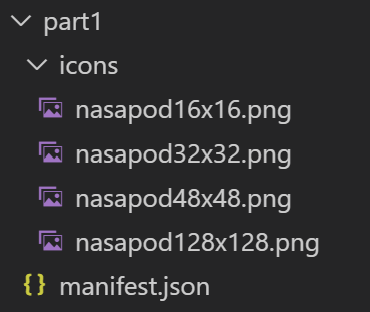
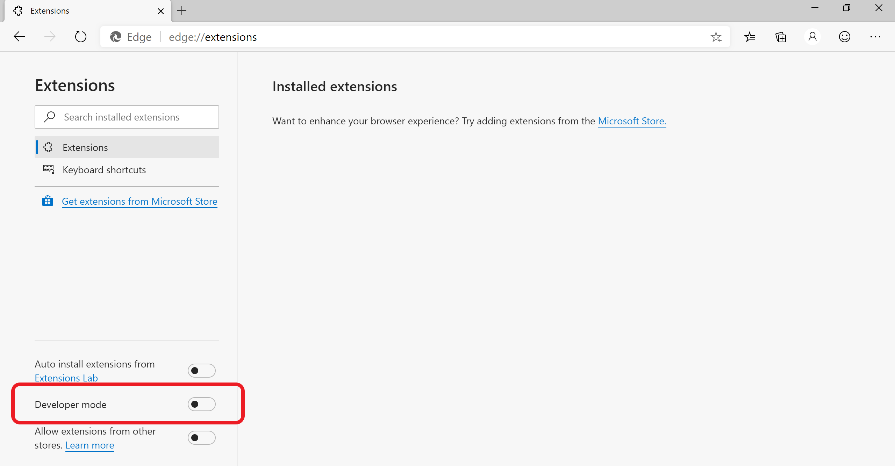

# Build a simple extension that pops up NASA picture of the day

<!-- <a href = "./extension-source/extension-getting-started-part1.zip" download>Completed Extension Package Source for This Part </a>  -->

[Completed Extension Package Source for This Part](extension-source/extension-getting-started-part1.zip)

## Overview

In part 1, our goal is to build a very simple Edge Chromium extension starting with an empty directory. Our goal for this extension is to do the following:

* Create icons for the extension that will be used in multiple places and in different sizes
* Create a simple `manifest.json` file
* Display a launch icon that when clicked displays a popup window containing the NASA picture of the day

## The manifest file basics

Every extension must have a `manifest.json` file in its root.  You can think of this as the blueprint for the extension. It tells the browser engine what version of the extension API the extension expects, the name and description of the extension, and lots of other details, many of which we will get to in this multi-part Extension Getting Started Guide. 

Below is the simple  `manifest.json`

```JSON
{
  "name": "NASA Picture of the day viewer",
  "version": "0.0.0.1",
  "manifest_version": 2,
  "description": "A chromium extension to show NASA's Picture of the Day."
}
```

## Extension icons setup

Next thing is to add some icons to `manifest.json` file (and create a new `/icons` directory with the icons files). These icons will be used for the background image of the button the user clicks to launch the extension (if there is one), and other places that are appropriate.  

`PNG` is the recommended format, but you can also use `BMP`, `GIF`, `ICO` and `JPEG`. It is recommended to always have at least a 128x128 pixels size icon and the browser will automatically resize it as necessary.

Your directory structure will now look like this



<!-- 
```
.
│   _manifest.json  
│
└───icons
│   │   nasapod16x16.png
│   │   nasapod32x32.png  
│   │   nasapod48x48.png  
│   │   nasapod128x128.png  
``` -->

and your updated `manifest.json` file is as follows.

```JSON
{
  "name": "NASA Picture of the day viewer",
  "version": "0.0.0.1",
  "manifest_version": 2,
  "description": "A chromium extension to show NASA's Picture of the Day.",
  "icons": {
    "16": "icons/nasapod16x16.png",
    "32": "icons/nasapod32x32.png",
    "48": "icons/nasapod48x48.png",
    "128": "icons/nasapod128x128.png"
  }
}
```

>[!NOTE]
>The icon `png` files listed above are available in the zip download mentioned at the top of this page.

## Adding a default popup dialog

Now, we will create an `HTML` file that will automatically run when the user clicks on the extension icon as shown here.


  We've named our HTML file as `popup/popup.html`. Clicking on the extension icon launches `popup/popup.html` as modal dialog that stays up until you click outside the dialog.

  For this, we will register this file as a default popup in the `manifest.json` under `browser_action` as follows.

```JSON
{
  "name": "NASA Picture of the day viewer",
  "version": "0.0.0.1",
  "manifest_version": 2,
  "description": "A chromium extension to show NASA's Picture of the Day.",
  "icons": {
    "16": "icons/nasapod16x16.png",
    "32": "icons/nasapod32x32.png",
    "48": "icons/nasapod48x48.png",
    "128": "icons/nasapod128x128.png"
  },
  "browser_action": {
    "default_popup": "popup/popup.html"
  }
}
```

In folder popup, let's add the file `popup.html` and let's have it render our stars image. Here's the `popup.html` file.

```HTML
<html lang="en">
  <head>
    <meta charset="UTF-8" />
    <title>NASA Picture of the Day</title>
  </head>
  <body>
    <div>
      
    </div>
  </body>
</html>
```

 Also, add an image file `images/stars.jpeg` that we have referenced in our `popup.html` file.

Our folder structure for our extension is this.


<!-- ```
.
│   _manifest.json  
│
└───icons
│   │   nasapod16x16.png
│   │   nasapod32x32.png  
│   │   nasapod48x48.png  
│   │   nasapod128x128.png    
│   
└───popup
|   │   popup.html
|     
└───images
    │   stars.jpeg 
``` -->

>[!NOTE]
>The `images/stars.jpeg` file listed above is available in the zip download mentioned at the top of this page.

That's everything we need to build a working extension. All that's left to is test it.  

The next section explains how to load the extension (we call that side loading) into the Edge  browser to test it.

## Run your extension locally in your browser while developing it (side-loading)

The Microsoft Edge Chromium browser provides a safe and simple way for you to run as well as debug your extensions while you are developing them.  

The process is quite simple.  All you need to do is click on the three dots at the top of your browser. Next, choose "Extensions" from the context menu as shown below.


When you are in the "Extensions" page as shown below, enable the "Developer mode" by enabling the toggle at the bottom left of the page as shown below.



## Installing and updating side-loaded extensions

The first time you want to install your extension, you choose the option "Load Unpacked" as shown below.  This prompts you for a directory where you have your extension assets file by file. This installs the extension as if you had downloaded it from a store.  


Once you've installed your extension, you can update it by clicking on the "Reload" button under your extension listing.

To remove the extension from your browser, click on the "Remove" button on the bottom of the extension listing.

## Debugging extensions

Debugging extensions is quite easy and supports all of the features in Edge Chromium DevTools. Those details however are not covered in this getting started guide but are very important to successfully build extensions.
