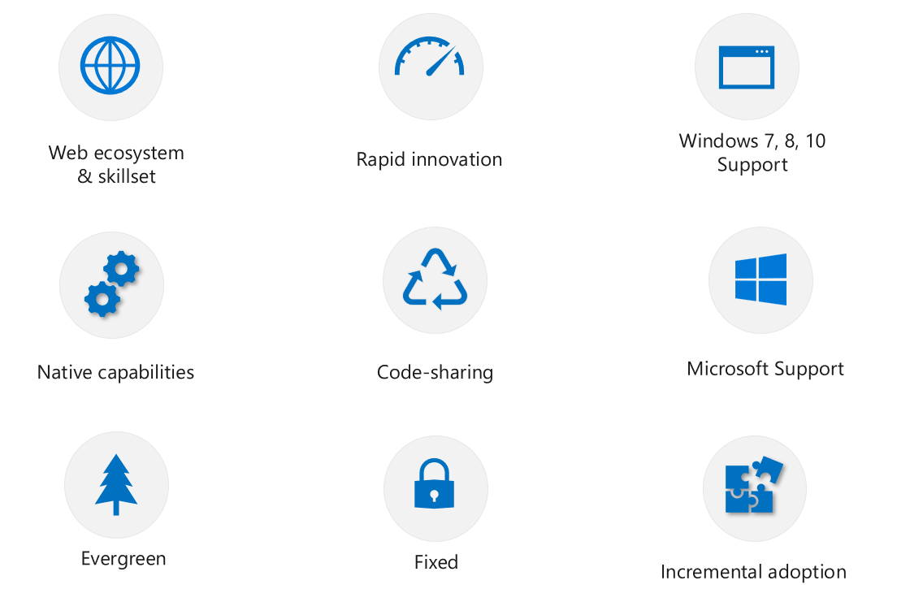

# Introduction to Microsoft Edge WebView2 (Preview)

The Microsoft Edge WebView2 control enables you to embed web technologies (HTML, CSS, Javacript) in your native application using [Microsoft Edge (Chromium)](https://www.microsoftedgeinsider.com/) as the rendering engine. 

With WebView2, developers can embed web code in parts of their native application or build the entire native application within a single WebView.

## Supported Platforms
> [!NOTE]
> The WebView2 control is currently in developer preview, during which you can prototype your solutions and share feedback with us to shape the future stable API. There will likely be some breaking changes as we evolve the API during preview, and when this happens, you will need to have both the WebView2 SDK and the Microsoft Edge (Chromium) browser updated. Breaking changes will be noted in the [release notes](webview2/releasenotes.md) of the SDK. This will lock down as WebView2 approaches beta and stable.

A developer preview is available for Win32 C/C++, .NET Framework 4.6.2 +, .NET Core 3.0, [WinUI 3.0](https://docs.microsoft.com/uwp/toolkits/winui3/) on Windows 10, Windows 8.1, Windows 8, Windows 7, Windows Server 2016, Windows Server 2012/2012R2, and Windows Server 2008 R2. 

## Getting Started
To build and test your application using the WebView2 control, you need to have both [Microsoft Edge (Chromium)](https://www.microsoftedgeinsider.com/download/) and the [WebView2 SDK](https://aka.ms/webviewnuget)installed. Select one of the options below to get started! 
- [Getting Started with Win32 C/C++]()
- [Getting Started with WPF]()
- [Getting Started with WinForms]()

## Benefits of WebView2

WebView2 is an essential component of hybrid applications, because it allows for: 

1. **Code Sharing:** Using web code allows developers to share their codebase across platforms.
2. **Rapid Innovation:** Web development allows for faster deployment and iteration.
3. **Web Ecosystem & Skillset:** Developers can utilize the entire web platform, tooling, and talent that exists within the web ecosystem.
4. **Native Capabilities:** Developers can access the full set of Native APIs.
5. **Incremental Adoption:** Developers can add web components piece by piece into their application.   

## WebView2 Samples

The [WebView2 Samples](https://github.com/MicrosoftEdge/WebView2Samples) repository contains samples that demonstrate all of the WebView2 SDK's features and their API use patterns. As we add more features to the WebView2 SDK, we will regularly update our sample applications.

## WebView2 Resources
### Concepts
### How-To Guides

## Feedback

Help us build a richer WebView2 experience by sharing your feedback! Visit our [feedback repo](https://aka.ms/webviewfeedback) to submit feature requests or bug reports. It’s also a good place to search for known issues.
During developer preview, we will also be collecting telemetry data to help us build a better WebView. Users can turn off WebView data collection by navigating to edge://settings/privacy in the browser and turning off browser data collection.
