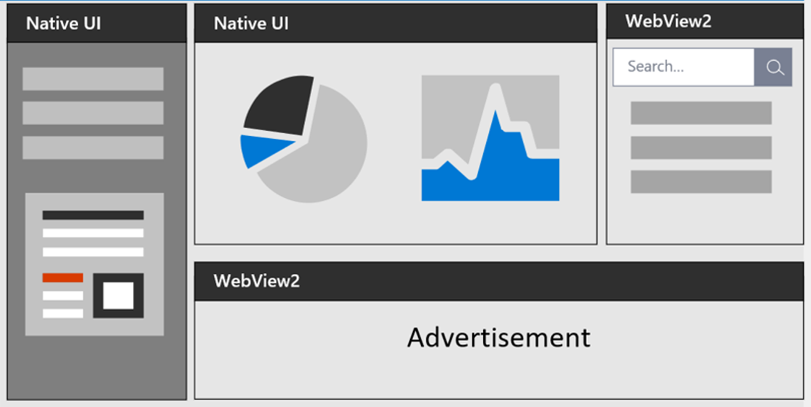

# Introduction to Microsoft Edge WebView2 (Preview)

The Microsoft Edge WebView2 control enables you to embed web technologies (HTML, CSS, Javacript) in your native application using [Microsoft Edge (Chromium)](https://www.microsoftedgeinsider.com/) as the rendering engine. 

With WebView2, developers can embed web code in parts of their native application or build the entire native application within a single WebView.

> [!NOTE]
> The WebView2 Preview is intended for early prototyping and to gather feedback from the developer community to helps us shape the future stable API. There will be [breaking changes](webview2/releasenotes.md), so it should NOT be used for production apps.

## Getting Started
To build and test your application using the WebView2 control, you need to have both [Microsoft Edge (Chromium)](https://www.microsoftedgeinsider.com/download/) and the [WebView2 SDK](https://aka.ms/webviewnuget)installed. Select one of the options below to get started! 
- [Getting Started with Win32 C/C++]()
- [Getting Started with WPF]()
- [Getting Started with WinForms]()

The [WebView2 Samples](https://github.com/MicrosoftEdge/WebView2Samples) repository contains samples that demonstrate all of the WebView2 SDK's features and their API use patterns. As we add more features to the WebView2 SDK, we will regularly update our sample applications.
- [Win32 C/C++ Sample]()
- [WPF Sample]()
- [WinForms Sample]()

## Hybrid Application Approach

Developers often have to chose between building a web application or a native application. The decision often hinges on the trade-off between Reach and Power.

Web applications allow for a broad reach. Web developers can reuse most, if not all of their code, across all different platforms. Native applications, however, can utilize the capabilities of the entire native platform.

Hybrid applications allow developers to enjoy the best of both worlds. Hybrid application developers benefit from the ubiquity and strength of the web platform as well as the power and full capabilities of the native platform.

## Benefits of WebView2

WebView2 is an essential component of hybrid applications, because it allows for: 

1. **Code Sharing:** Using web code allows developers to share their codebase across platforms.
2. **Rapid Innovation:** Web development allows for faster deployment and iteration.
3. **Web Ecosystem & Skillset:** Developers can utilize the entire web platform, tooling, and talent that exists within the web ecosystem.
4. **Native Capabilities:** Developers can access the full set of Native APIs.
5. **Incremental Adoption:** Developers can add web components piece by piece into their application.   

## Next Steps
To build more complciated webviews look at some concepts to read and try out some how to stuff
### Concepts
1. Sentence long title Link
2.
3.
4.
### How-To Guides
1.
2.
3.
4.

## Supported Platforms
A developer preview is available for Win32 C/C++, .NET Framework 4.6.2 or later, .NET Core 3.0 or later, [WinUI 3.0](https://docs.microsoft.com/uwp/toolkits/winui3/) on Windows 10, Windows 8.1, Windows 8, Windows 7, Windows Server 2016, Windows Server 2012/2012R2, and Windows Server 2008 R2. 

## Feedback

Help us build a richer WebView2 experience by sharing your feedback! Visit our [feedback repo](https://aka.ms/webviewfeedback) to submit feature requests or bug reports. It’s also a good place to search for known issues.
During developer preview, we will also be collecting telemetry data to help us build a better WebView. Users can turn off WebView data collection by navigating to edge://settings/privacy in the browser and turning off browser data collection.
